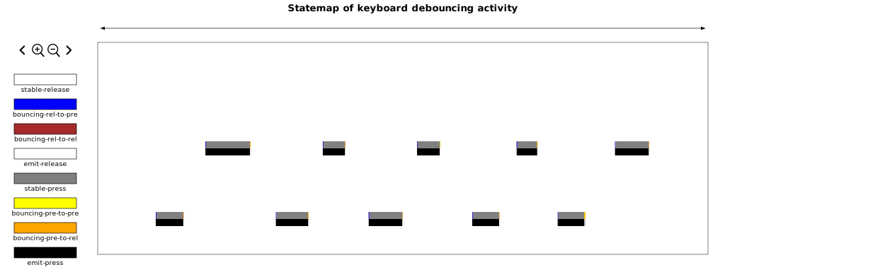
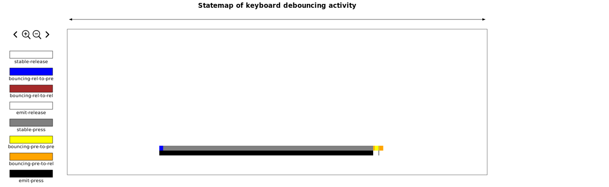
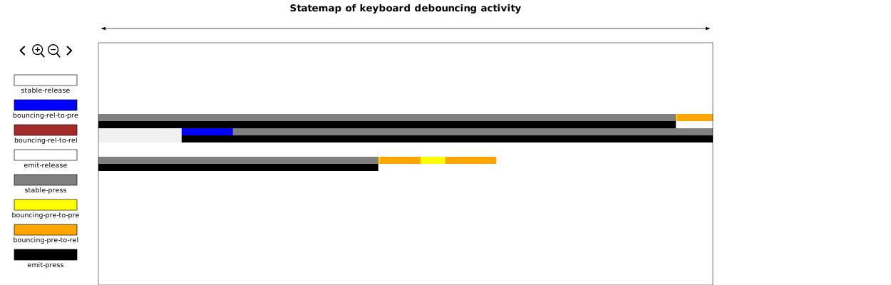

My keyboard is bouncing as I type this.
My new keyboard.
My favorite keyboard.
The DMOTE.

It's a little frustrating to have a great time typing away only to have it
crash to a grinding halt as you have to pause, be reminded of your failure as a
firmware engineer, and go back to delete an extra 'a' or space character.

I have to fix this; I have to destroy the bug with extreme prejudice.
I must know what the problem is; I need to see the whites of its eyes.
Practically, I have to create a summary that would allow me to see the problem.

No such summary's are coming.
I guess I'll get on with gathering the data, without agreggating.
It can't be that much code, and surely doing it will allow me to see the summary
I need.

# Fly spotting

The first step to spot a fly is to keep you eyes peeled.
In my case, it's to build observability into firmware.

Pondering on this for a few days, I settled on a pretty simple technique:
I would dump all of the debouncer state and triggers to memory and slurp them
out with a custom debugger-based tool.

I wonder, to myself, if this would actually work.
For it to work, I need at least a few thing:
 * A debugger-based tool for slurping out of RAM.
 * A method for putting state into a RAM buffer that the debugger-tool could
   read out at a reasonable pace.

Tackling them in the order I wrote them, I build the tool.
I reach for probe-rs, as I like writing Rust, even for small tools, and as I
had heard good things about it.

I write a few test programs, confirming that I can slurp memory from the left
side firmware, because if that one goes down, I can restart it without taking
down the whole keyboard.

"It works. I can dump RAM without interrupting the keyboard." 
I say quietly to myself.
Well that solves the first problem, I guess. 
On to the next problem: that pesky protocol.

"20KB, in 800ms?" I had included benchmarks in the program just to be sure
things did not take too long.

I run the test program several more times to be sure on the 800ms number.
It was surprisingly stable, varying by no more than half a milisecond in either
direction.
Then I use a calculator in my terminal to compute the full bit rate.

"25600 bytes per second. It's not fast, but maybe I'll be able to make it
work." I think to myself. "How much throughput do I really need though?"

So I started doing the math, and writing it out in a comment in the code:

```
// The debugger reads 20480 bytes in 800ms (it's very stable too), or 25.6kbps.
// Copying all samples, 5kilohz * 6 bytes/sample, takes 30kbps. So we're going
// to have to come up with another strategy.
//
// I'm hoping that I can record all relevant events, that is all state changes
// in the debouncer, and all emitted key events. I'll have to have something
// that contains row col and the state. It would be really convenient if it fit
// in an integer number of 32bit transfers.
//
// I estimate that with the structure in shared-types, being a u64 in size, that
// the debugger would be able to read a maximum of 3200 of them in  a single
// second. I wrote a test program to test this theory, and was able to get about
// 3160 records per second.
//
// In other words, if you manage to trigger more than about 3000 events per
// second for longer than about 1/3 of a second, it will overflow and you will
// lose events. Don't type that fast.
```

Well, that settled that. Now to create that structure that I gave myself a
`u64` for, how generous of me.

Well, I have to use a u32 for the timestamp, since I won't be able to rely on
every sample being present.
And I have to have the row and column numbers, which are most easily
represented as u8s.
I also need the state that the debouncer is in, and maybe the output from the
debouncer, or the trigger, as I have taken to calling it.

I represent the debouncer state and the trigger as C-like enums with
`#[repr(u8)]` to be sure they fit where they're supposed to, and I make the
obvious struct from the above description, with `#[repr(C)]` so that its layout
is reliable.

Moving right along, I modify my keyboard-scanning-iterator-structure to accept
a Log, what I decide to call my block of memory used for observability
purposes.
This presents some perils, but I get through them.
Suffice it to say that when your types are `Copy` sometimes they copy
themselves, and the original is no longer updated.

Excited by my progress, I go right to bed, because it's now my bedtime.

# Making sense of fly data

Today the idea struck me: can I use a statemap to solve this problem?
It would probably allow me to be able to _see_ the bouncing in a very real way,
other than being infurated by the double letters and symbols that taunt you
until you delete them from your view.
But they remind you of your failings as a firmwware engineer just the same, 
even when they're not there.

Anyway, I should get on writing this thing now.

I flounder around fidling with elf parsers until I'm able to get someting
working with ddbug_parser that allows me to grab the location of `THELOG`
(there can only be one) from the binary I flashed to the left side of my
keyboard last night.
Now I can really begin to make progress on this statemap thing, after I start
dumping the KeyState structs from RAM on the MCU.

I get on with it then.

Taking many short cuts, it's a hacky tool for a very specific purpose, okay?,
I transmute memory and magic happens: I start dumping KeyStates.

Well, I suppose I'll install the statemap tool then.
And it's not in Nixpkgs, a submodule it is.
It builds and runs without issues.

So I start reformatting the KeyState data as JSON, trying to conform to the
format that the statemap tool requires.
It's very picky.
It even wants a sorted list of the input.
very picky.
That's okay, I can sort lists, or well I can instruct my computer to sort.

Or maybe, I can do one better by slurping them _and_ the MCU's internal head
offest.
I'll read from head until the end, where the oldest data lies, then read from 
the beginning, at offset 0, until, but not including, head, where the newer
data lies.

To my surprise (though it should not be), this works; I have a statemap.
What a mess.
Everything is so tiny!
So it turns out that keyboards have a lot of time where they're just waiting
to be typed on, and when things start happening, it's a storm of many keys
being pressed, states being transitioned and then quiet again, ending as 
abruptly as it started.
In retrospect, this should have been more obvious.

# Finding a fly

Well it would be really hard to just spot a double key-press-release-sequence
in the storm of data.
Luckily, this is very reproduceable, so I make it happen again.

Now I make another statemap, after having alternated the a key and the space
key until a double appeared.

It was the spacae that did it first.

Careful not to touch many other keys, I slurped out the state data and made yet
another statemap.
Finding the alternating keys was easy so I zoomed in on them:


Now, I know that it was the second to last key press in the sequence, but it's
really hard to see without zooming.
You can play with the statemaps on this page by right-clicking and selecting
"view image", well at least in Firefox.

So, now that we can see that the keys are, in fact, alternating, I zoom in on
the offending double press:


The end of that key press looks a bit funky, I think. Just to be sure, let's
take a closer look.


So now it's a bit more visible: there's a really short sequence of black,
indicating that the key was reported as pressed, for what looks like right
about half a millisecond (You can get timestsmps by clicking on the 
interactive version if you "view image").

So looking at it something strikes me: It's yellow, indicating that it's
boucing coming from the pressed state and headed to the pressed state, before
stablizing as pressed agai.
It's not supposed to do that.
It's not supposed to stablize from yellow.
Orange, perhaps, but not yellow.

So that's the problem: The debouncer has decided that it's stable when it's
still bouncing.

Looking at the graph, the signal has stopped bouncing for about 6ms (well
5.6ms because it's from offset 12.6ms to 18.2ms, but I'm rounding) in the
middle of a release event.

So I should probably have the debuncer set to wait for 10ms of stable signal
before marking it stable.

# Squashing the fly with a statemap

So my debouncer is tuned to 15ms now (there was another instance, later when
reproducing the graphs for the 6th time, because it's fun, that had a gap of
about 12ms, and I want some extra certainty that it won't happen again).

Statemaps are pretty cool.

But I'm not satisfied until I'm able to reproduce the _cause_ without the
effect.
So I make yet another statemap, of course:


Yes this is a statemap of me smashing the home row like a monkey on a 
typewriter, why do you ask?
So this one is quite interesting because it has a similar problem, in that the
yellow segment is about 6ms long, and it displays another related problem,
that first orange segment is about 12ms long _before_ reaching the yellow
segment.
As it turns out the parameter affects the minimum time in all states with a
color, so all states with bouncing in their name, curing this ill as well.
